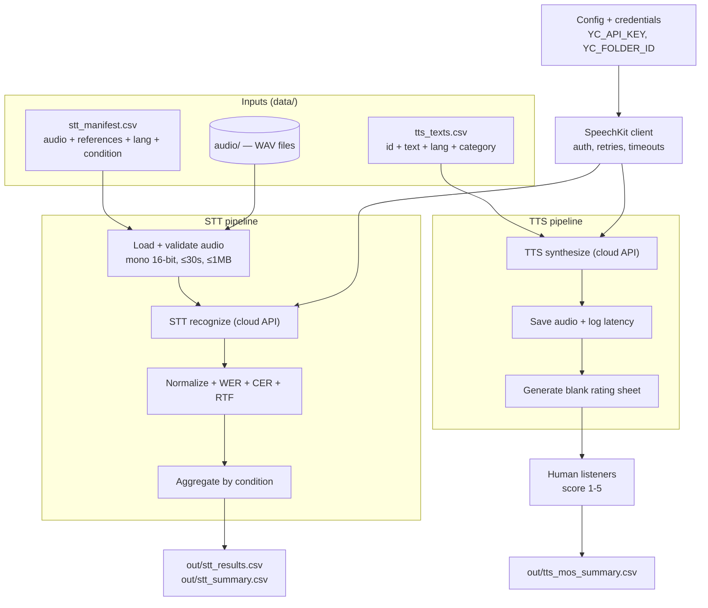

# SpeechKit beta eval — build plan

A spec for building a self-contained evaluation harness that answers one
question: **does Yandex SpeechKit perform well enough on our audio?** Cloud API
only, single machine, no production infrastructure. This document is the build
brief — work through the task list in order.

---

## How it works (schema)



Two independent pipelines share one API client. STT is fully automated and
produces quantitative scores. TTS is automated up to audio generation; the
quality verdict comes from human raters scoring the generated clips, which an
optional aggregation step rolls up into a MOS summary.

---

## Target folder structure

```
speechkit-eval/
├── README.md
├── requirements.txt              # requests, jiwer, python-dotenv, pytest
├── .env.example                  # YC_API_KEY=, YC_FOLDER_ID=
├── .gitignore                    # data/audio/, out/, .env
├── config.py                     # env loading + constants (URLs, limits, defaults)
├── speechkit/
│   ├── __init__.py
│   ├── client.py                 # SpeechKitClient: stt_recognize(), tts_synthesize()
│   └── audio.py                  # WAV load/validate, ffmpeg convert/segment helpers
├── eval/
│   ├── __init__.py
│   ├── metrics.py                # normalize(), wer(), cer(), rtf()
│   ├── stt_runner.py             # batch STT -> per-file records
│   ├── tts_runner.py             # batch TTS -> audio + latency log + rating sheet
│   └── report.py                 # aggregate by condition; CSV + console table; MOS rollup
├── data/
│   ├── stt_manifest.csv          # sample provided
│   ├── tts_texts.csv             # sample provided
│   └── audio/                    # input WAVs (gitignored)
├── out/                          # all outputs (gitignored)
├── scripts/
│   ├── run_stt.py                # CLI entrypoint -> eval/stt_runner.py
│   ├── run_tts.py                # CLI entrypoint -> eval/tts_runner.py
│   ├── score_mos.py             # read filled rating sheet -> MOS summary
│   └── prep_audio.sh             # ffmpeg convert to mono WAV + segment to 30s
└── tests/
    ├── test_metrics.py           # offline unit tests for normalize/wer/cer
    └── test_audio.py             # WAV validation unit tests
```

---

## Module contracts

- `config.py` — `API_KEY`, `FOLDER_ID` from env (fail fast if missing);
  `STT_URL`, `TTS_URL`, `MAX_BYTES=1_048_576`, `MAX_SECONDS=30`, default voice/format.
- `speechkit/client.py` — `SpeechKitClient(api_key, folder_id)` with
  `stt_recognize(pcm, rate, lang) -> str` and
  `tts_synthesize(text, lang, voice, fmt) -> bytes`. Timeout 120s, retry on
  5xx/timeout with exponential backoff (max 3), surface API error body on 4xx.
- `speechkit/audio.py` — `load_wav(path) -> (pcm, rate, channels, sampwidth, duration)`;
  `validate(...) -> list[str]` of warnings; ffmpeg wrappers `to_mono_wav()`, `segment()`.
- `eval/metrics.py` — `normalize(text, numbers_to_words=False) -> str`;
  `wer(ref, hyp)`, `cer(ref, hyp)` (via jiwer on normalized text); `rtf(proc, dur)`.
- `eval/report.py` — `aggregate(records, by="condition") -> rows`;
  `write_csv()`, `print_table()`; `mos_summary(rating_rows) -> by-category means`.

---

## Task list

### Phase 0 — Scaffold
- [ ] Create the folder tree above with empty `__init__.py` files.
- [ ] `requirements.txt`, `.env.example`, `.gitignore`.
- [ ] `config.py` loading env via python-dotenv; raise a clear error if
      `YC_API_KEY` / `YC_FOLDER_ID` are unset.
- **Done when:** `python -c "import config"` works with a populated `.env`.

### Phase 1 — SpeechKit client
- [ ] `client.py` with `stt_recognize` (POST lpcm body, params folderId/lang/
      format/sampleRateHertz, `Authorization: Api-Key` header) and
      `tts_synthesize` (POST form text/lang/voice/format/folderId, returns bytes).
- [ ] Retry with backoff on transient errors; on 4xx raise with the response body.
- **Done when:** a manual smoke test recognizes one short WAV and synthesizes
      one phrase to an mp3 that plays.

### Phase 2 — Audio utilities
- [ ] `audio.py`: `load_wav`, `validate` (flag non-mono, non-16-bit, >30s, >1MB).
- [ ] ffmpeg wrappers + `scripts/prep_audio.sh` (convert to mono WAV; segment to 30s).
- **Done when:** `test_audio.py` passes on a known-good and a known-bad WAV.

### Phase 3 — Metrics
- [ ] `metrics.py`: `normalize` (lowercase, strip punctuation, collapse
      whitespace, Unicode-safe; optional digit→word toggle), `wer`, `cer`, `rtf`.
- [ ] `test_metrics.py`: identical strings → 0.0; one substitution in five words
      → 0.2; Cyrillic + Kazakh inputs handled.
- **Done when:** `pytest tests/` passes offline (no network).

### Phase 4 — STT runner
- [ ] `stt_runner.py`: read manifest, per row load+validate+recognize+score,
      record skip/error states without aborting the batch, return records.
- [ ] `scripts/run_stt.py` argparse entrypoint (`--manifest`, `--audio-dir`, `--out`).
- **Done when:** running on the sample manifest produces `out/stt_results.csv`
      with one row per file and correct status handling for oversized files.

### Phase 5 — TTS runner
- [ ] `tts_runner.py`: read texts, synthesize, save audio to `out/tts_out/`,
      log latency + char count, generate `out/tts_rating_sheet.csv` (blank
      naturalness/intelligibility columns). Treat `kk-KZ` failures as expected,
      logged, non-fatal.
- [ ] `scripts/run_tts.py` argparse entrypoint (`--texts`, `--voice`, `--format`).
- **Done when:** sample texts synthesize, Kazakh rows are logged as errors not
      crashes, and a populated rating sheet is written.

### Phase 6 — Reporting
- [ ] `report.py`: aggregate STT records by condition + overall (mean WER/CER/RTF,
      n); console table + `out/stt_summary.csv`.
- [ ] `scripts/score_mos.py`: read a filled rating sheet, average naturalness +
      intelligibility per category, write `out/tts_mos_summary.csv`.
- **Done when:** summary shows per-condition rows plus an OVERALL row; MOS
      rollup runs on a filled sheet.

### Phase 7 — Dry-run mode + docs
- [ ] Add `--dry-run` to both runners: mock the client (canned hypotheses /
      silent audio) so the full pipeline runs with no credentials and no network.
- [ ] Write `README.md`: setup, credentials, manifest format, run commands,
      output interpretation, the caveats below.
- **Done when:** `python scripts/run_stt.py --dry-run` completes end to end and
      writes valid CSVs.

---

## Constraints the builder must respect

1. **Per-condition results are the product.** The summary must break WER/CER
   down by the `condition` column, not just emit one blended number. A single
   figure hides the Russian-vs-Kazakh gap that the whole eval exists to expose.
2. **Kazakh STT yes, Kazakh TTS no.** Recognition supports `kk-KZ`; standard
   synthesis voices are Russian/English/Turkish only. TTS must handle Kazakh
   rows as expected, logged failures — never abort the batch.
3. **Sync endpoint limits.** STT v1 sync is mono 16-bit WAV, ≤30s, ≤1MB.
   Oversized files are skipped with a status note, not errors. (Full-call/async
   long-audio recognition is explicitly out of scope for this beta.)
4. **Number normalization is a policy choice.** Recognized "5000" vs reference
   "пять тысяч" scores as errors. The digit→word toggle in `normalize()` exists
   for this; default off, documented, applied consistently.
5. **No secrets in code or output.** Credentials only via `.env`; `.env`,
   `data/audio/`, and `out/` are gitignored.

## Definition of done
`pytest tests/` green offline; both runners complete in `--dry-run` with no
credentials; with real credentials, STT produces a per-condition summary and TTS
produces audio + a rating sheet; README lets a new person run it from scratch.
